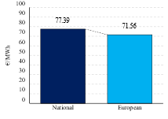

# ***European Renewable Energy Targets - Better Together?***
**Pascal Fröhlich, Moritz Böschow, Felix Müsgens**
> Achieving the goal of climate neutrality in Europe by 2050 poses a major challenge for both individual countries and the overall European energy system. One of these areas to decarbonize is the electricity sector. Regarding the upcoming interim targets for the renewable share on generation for 2030, considerable deviations are already apparent at the country level. Therefore, the study presents two scenarios, one that considers national expansion based on the country targets for 2030 and one that refers to the harmonized European system. Our results show that adjusting country-specific targets would have positive effects on the overall European electricity system. The findings underscore the importance of future cooperation in achieving the set climate targets.

**Keywords:**
  Renewable Energy Sources, European Targets, Electricity Market, Investment Modelling 

## Model - EEM26 - Trondheim
This repository contains the code and data of our study submitted to the EEM2026 Conference in Trondheim. This model is based on our basic model from [Basic Model](../01_Basic%20Model/). For this study, we model the European energy system based on exististing electricity bidding zones, with each zone representing a single node. The model covers the year 2030 with annual investment decision and hourly dispatch resolution. Our model is used to analysze a national and a Europe-wide scenario for the targets of renewable shares.
- The input data including hourly and yearly values are provided in the [Input Data](01_Input%20Data/).
- The model consists of two GAMS files, one for reading data ([Data_input](Data_input/)) and one containing the declaration of variables and constraints in [EEM26](EEM26.gms/).
- The result excel files for both scenarios can be found in [Results](02_Results/).

## Scenarios
|National|European|
|:--------:|:--------:|
|  |  |

## Results
|Total system costs|Total system emissions|Average system electricity price
|:--------:|:--------:|:--------:|
|  |  |  |

### Node-specific ratio of European and national RES generation
|Nodes|Bars|
|:--------:|:--------:|
|  |  |
