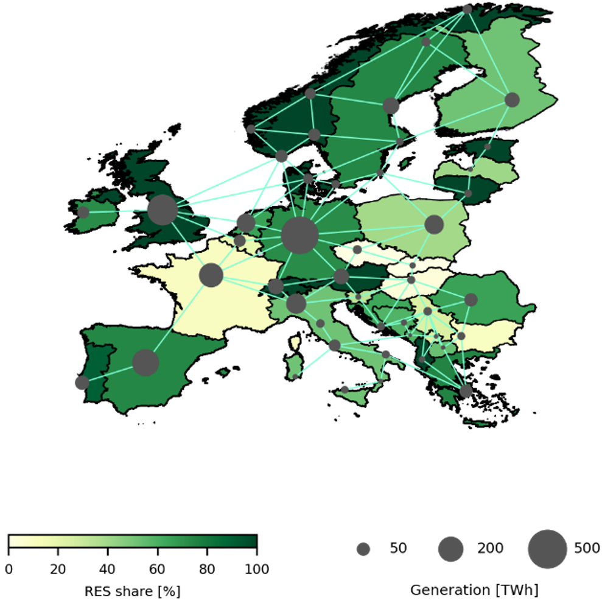
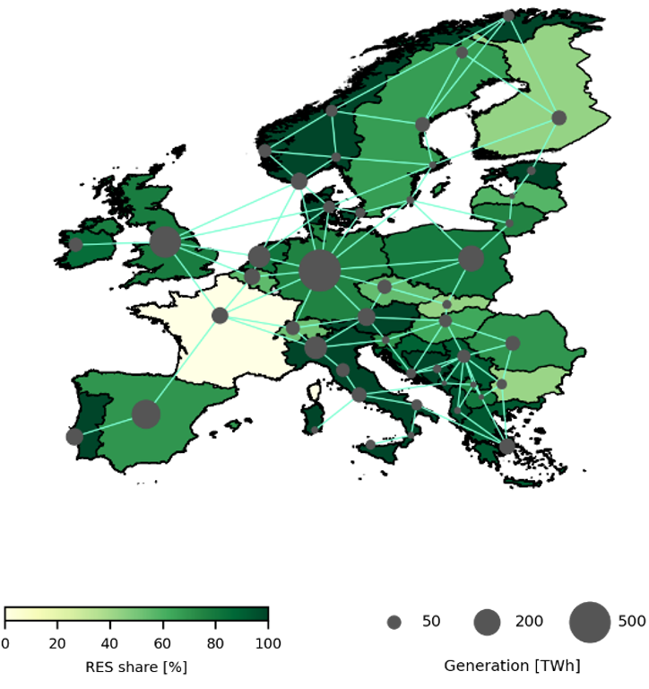
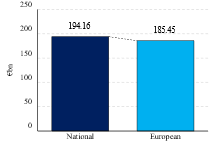
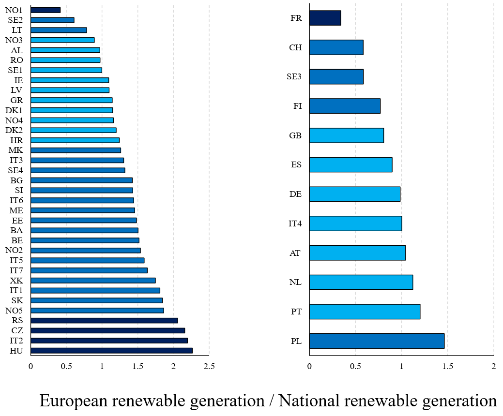

# Model - EEM2026 - Trondheim

This repository contains the code and data of our study submitted to the EEM2026 Conference in Trondheim. This model is based on our basic model from [Basic Model](../01_Basic%20Model/). For this study, we model the European energy system based on exististing electricity bidding zones, with each zone representing a single node. The model covers the year 2030 with annual investment decisiosn and hourly dispatch resolution. Our model is used to analysze a national and a Europe-wide scenario for the targets of renewable shares.
- The input data including hourly and yearly values are provided in the [Input Data](01_Input%20Data/) folder.
- The model consists of two GAMS files, one for reading data ([Data_input](Data_input/)) and one containing the declaration of variables and constraints in [EEM26](EEM26.gms/).
- The result excel files for both scenarios can be found in [Results](02_Results/).

## Scenarios
|National|European|
|:--------:|:--------:|
|  |  |

## Results
### Total system costs

### Total system emissions

### Average system electricity price

### Node-specific ratio of European and national RES generation
|  |  |
