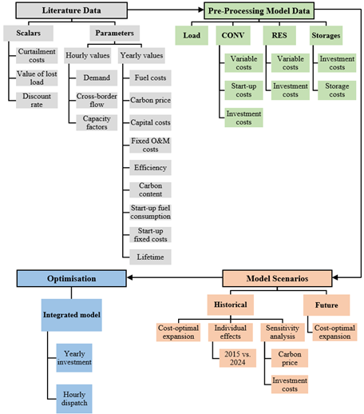

# Input data and GAMS code for the paper ***"The Competitiveness of Renewables: An Analysis of Magnitude, Geography, and Drivers"***

## Pascal Fröhlich, Maximilian Bernecker, Felix Müsgens (2026). in review

> While renewable energy sources are the fastest-growing electricity generation technology globally, their competitiveness is still the subject of controversy. This paper presents an electricity system model for investment and dispatch to determine the cost-optimal shares of renewable energy sources. We compute and analyse renewable generation shares in market equilibrium for Germany and Texas, using annual data for 2015 to 2024, and in five-year intervals for 2030 to 2050. Furthermore, we identify the key drivers of the renewable competitiveness and quantify their contribution through parameter variations. Our results show that renewable generation achieves considerable market shares even without subsidies. In Germany, the increase in renewable generation is primarily driven by CO2 pricing, complemented by declining investment costs for renewable technologies. In Texas, solar PV is part of the cost-optimal system, even in the absence of CO2 pricing and despite low natural gas prices.

### Keywords:
Cost optimisation, Economic modelling, Energy transition, Historical analysis, Renewable energy expansion

### Links:
Working paper: ...

### Description:
The folders are structured as follows.
  The folder [01_Basic Model](01_Basic%20Model/) contains:
- two separate GAMS files for the model, one for reading and determining the parameters for Germany (DE) and Texas (TX) (Data_Input.gms) and one for declaring the variables and model constraints in Model.gms,
- an opt.file for the cplex solver,
- a cost analysis for the various technologies to determine the investment costs (see [01_Cost Analysis](01_Basic%20Model/01_Cost%20Analysis/)),
- final input data for the historical and future time period in [02_Input Data](01_Basic%20Model/02_Input%20Data/) (this is further subdivided into hourly input data, such as demand, trade, availability factors for RES, and annual values, such as investment costs, fuel and carbon prices and applies separately to both systems), and
- result files for both electricty systems for the historical and future time period in [03_Results](01_Basic%20Model/03_Results/)

The figures from the paper are located in [02_Figures](02_Figures/).
  The customized model for the EEM26 conference in Trondheim can be found in [03_Adjusted Model EEM26](03_Adjusted%20Model%20EEM26/)

### Framework:

